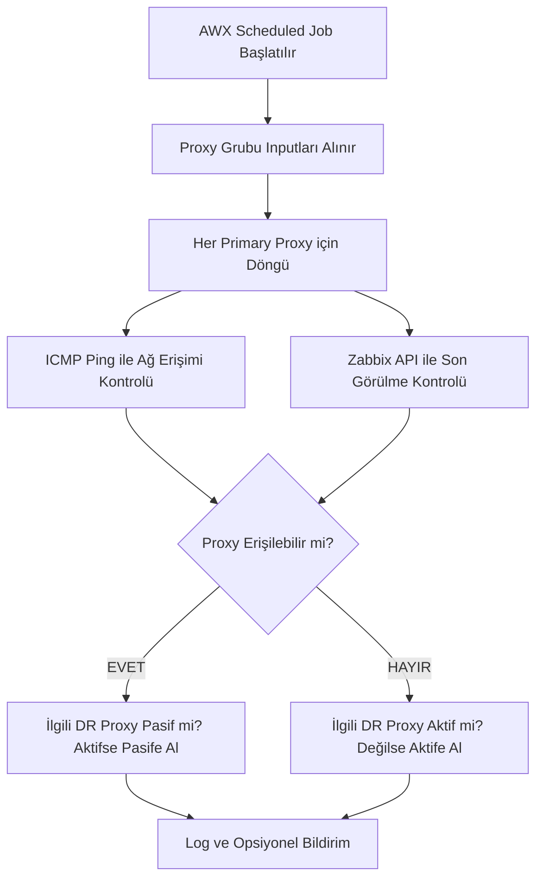

# Zabbix Proxy Disaster Recovery (DR) Otomasyon Projesi  
**(Ansible AWX ile Dinamik Proxy Aktif/Pasif Yönetimi)**

---

## 1. Proje Özeti

Bu proje, çoklu veri merkezlerinde Zabbix Proxy'ler için otomatik felaket kurtarma (Disaster Recovery - DR) mekanizması geliştirmeyi amaçlar. Ansible AWX ile merkezi ve zamanlanmış görevler kullanılarak, birincil (primary) proxy'lerin erişilemez olması durumunda DR proxy'lerin otomatik olarak aktif edilmesi, birincil proxy'ler tekrar erişilebilir olduğunda ise DR proxy'lerin otomatik olarak pasif edilmesi sağlanır.  
Her proxy grubu için dinamik olarak çalışan playbook'lar, ilgili grubun primary ve DR proxy'lerini input olarak alır ve bu doğrultuda işlemlerini gerçekleştirir.

---

## 2. Mimari Bileşenler

- **Zabbix Server:** Merkezi izleme sunucusu.
- **Zabbix Proxies (Primary):** Normalde aktif olan, veri toplayan proxy'ler.
- **Zabbix Proxies (DR):** Sadece birincil proxy devre dışı kaldığında aktif olacak pasif proxy'ler.
- **Ansible AWX:** Otomasyon ve merkezi yönetim platformu.
- **Zabbix API:** Proxy ve host yönetimi için kullanılan arayüz.

---

## 3. Dinamik Playbook ve Input Yapısı

- Her proxy grubu için ayrı bir playbook veya parametrik bir playbook şablonu kullanılır.
- Playbook, **primary_proxies** ve **dr_proxies** şeklinde input (parametre) alır.
- Bu inputlar, AWX Job Template üzerinde prompt olarak veya envanter değişkenleriyle sağlanabilir.

**Örnek Input:**
```yaml
primary_proxies:
  - name: zabbix-proxy-1
    ip: 10.134.16.80
    zabbix_proxy_id: 10101
  - name: zabbix-proxy-2
    ip: 10.134.16.81
    zabbix_proxy_id: 10102

dr_proxies:
  - name: zabbix-proxy-dr-1
    ip: 10.134.16.90
    zabbix_proxy_id: 20101
    backup_for: zabbix-proxy-1
  - name: zabbix-proxy-dr-2
    ip: 10.134.16.91
    zabbix_proxy_id: 20102
    backup_for: zabbix-proxy-2
```

---

## 4. İş Akışı (Workflow)



---

## 5. Playbook Akışı ve Modüller

- **ICMP Ping:**  
  `ansible.builtin.ping` veya `ansible.builtin.wait_for` modülü ile primary proxy'ye ping atılır.
- **Zabbix API Son Görülme:**  
  `community.zabbix.zabbix_proxy_info` veya özel Python scripti ile proxy'nin son görülme zamanı kontrol edilir.
- **DR Proxy Durum Yönetimi:**  
  Zabbix API ile ilgili DR proxy'nin aktif/pasif durumu değiştirilir.
- **Raporlama:**  
  Yapılan değişiklikler AWX loglarına yazılır, opsiyonel olarak bildirim gönderilir.

---

## 6. Envanter ve Değişkenler

AWX envanterinde her proxy için aşağıdaki gibi değişkenler tanımlanır:

```json
{
  "ansible_host": "10.134.16.80",
  "ansible_user": "root",
  "ansible_password": "T33!S40!Rg1",
  "ansible_become": true,
  "ansible_become_method": "su",
  "proxy_role": "primary",           // "primary" veya "dr"
  "dr_for": "zabbix-proxy-1",        // Sadece DR proxy için: yedeklediği primary proxy adı
  "zabbix_api_url": "http://10.134.16.210/zabbix/api_jsonrpc.php",
  "zabbix_api_user": "Admin",
  "zabbix_api_password": "zabbix"
}
```

---

## 7. Zabbix API Entegrasyonu

- Zabbix API ile login olunur, auth token alınır.
- Proxy'lerin son görülme zamanı ve aktif/pasif durumu API üzerinden sorgulanır ve değiştirilir.
- Gerekirse host ekleme/silme gibi işlemler de API ile yapılabilir.

**Örnek Python Script:**  
(Detaylar için önceki mesajdaki script kullanılabilir.)

---

## 8. Güvenlik ve En İyi Pratikler

- API şifreleri ve hassas bilgiler Ansible Vault ile şifrelenmelidir.
- Script ve playbook'lar versiyon kontrolünde tutulmalı, değişiklikler izlenmelidir.
- Zamanlanmış görevler için uygun loglama ve bildirim mekanizmaları kurulmalıdır.

---

## 9. Sonuç

Bu mimari ile Zabbix Proxy DR süreçleri tamamen otomatik, merkezi ve güvenilir şekilde yönetilebilir. Her proxy grubu için dinamik ve parametrik playbook'lar sayesinde, sistem esnek ve ölçeklenebilir olur. Manuel müdahale ihtiyacı ortadan kalkar, izleme sürekliliği ve veri bütünlüğü sağlanır. 